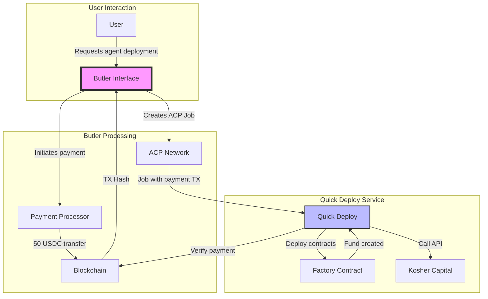

# Butler Integration for Kosher Capital Quick Deploy

## Overview

Butler is the user-facing interface in the Virtuals ACP ecosystem that handles agent deployment requests and payment processing. This document outlines the integration flow between Butler and our Quick Deploy service.

## Butler Flow



## Integration Points

### 1. **Payment Processing**
- Butler collects 50 USDC from user
- Processes payment on Base network
- Captures payment transaction hash
- Passes TX hash to Quick Deploy via ACP job

### 2. **Job Creation**
Butler creates an ACP job with:
```typescript
{
  jobId: "butler-job-xxx",
  params: {
    userWallet: "0x...",           // User's wallet
    paymentTxHash: "0x...",        // 50 USDC payment TX
    agentName: "ACP-{timestamp}",  // Optional, auto-generated
    executeOnChain: false          // Butler already paid
  }
}
```

### 3. **Contract Deployment**
Per meeting notes: "Contract creation TX hash needs to be generated outside of ACP"
- Quick Deploy receives payment TX from Butler
- Executes 3-transaction deployment flow
- Returns deployment details to Butler

## Optimizations Implemented

### 1. **Automated Payment TX Hash Capture**
- Butler automatically provides payment TX hash in job parameters
- No manual intervention required
- Quick Deploy verifies the payment on-chain

### 2. **Streamlined Contract Creation**
- If Butler provides payment TX, we skip payment step
- Execute only fund creation and enable trading
- Reduces deployment time

### 3. **Pre-filled Data**
- Agent names auto-generated with "ACP-" prefix
- User wallet captured from Butler
- All required data provided in job

### 4. **Enhanced Status Feedback**
- Webhooks for deployment status
- Transaction tracking throughout process
- Status API for real-time monitoring

### 5. **Error Handling**
- Clear error messages for Butler integration
- Retry logic for failed deployments
- Comprehensive logging

## Configuration for Butler

### Environment Variables
```env
# Butler-specific configuration
BUTLER_CALLBACK_URL=https://butler.virtuals.io/webhook
BUTLER_API_KEY=your-butler-api-key

# Ensure these are set for Quick Deploy
SHEKEL_API_KEY=your-shekel-api-key
FACTORY_CONTRACT_ADDRESS=0x0fE1eBa3e809CD0Fc34b6a3666754B7A042c169a
SERVICE_PRICE=50
```

### Status Callbacks
Butler can monitor deployment status via:
```
GET /api/deployments/{jobId}
```

### Webhook Events
Butler receives events at configured webhook URL:
- `agent.deployed` - Successful deployment
- `agent.deployment.failed` - Failed deployment

## Testing with Butler

### 1. Mock Butler Request
```typescript
const mockButlerRequest: AgentRequest = {
  jobId: 'butler-test-001',
  buyer: '0xUserWallet',
  params: {
    userWallet: '0xUserWallet',
    paymentTxHash: '0xPaymentTxHash',
    agentName: 'ACP-TestAgent'
  }
};
```

### 2. Verify Payment Flow
```bash
# Test with Butler-provided payment
pnpm tsx test-utils/testButlerIntegration.ts
```

### 3. Monitor Deployment
```bash
# Check status
curl http://localhost:3001/api/deployments/butler-test-001
```

## Troubleshooting Butler Integration

### Common Issues

1. **"Butler must provide paymentTxHash"**
   - Ensure Butler is passing payment TX hash
   - Check job parameters structure

2. **"Invalid payment transaction"**
   - Verify payment is 50 USDC to correct address
   - Check transaction is confirmed on Base

3. **"Contract creation failed"**
   - Ensure wallet has ETH for gas
   - Verify factory contract is accessible

### Debug Mode
Enable detailed Butler logging:
```bash
LOG_LEVEL=debug BUTLER_DEBUG=true pnpm quickdeploy
```

## Future Enhancements

1. **Direct Butler API Integration**
   - Real-time status updates to Butler
   - Automatic retry on Butler's behalf

2. **Payment Optimization**
   - Batch deployments for multiple users
   - Gas optimization strategies

3. **Enhanced Monitoring**
   - Butler-specific dashboard
   - Performance metrics tracking

---

For more information, see:
- [Quick Deploy Documentation](./kosher-capital-integration.md)
- [ACP Overview](./ACP-OVERVIEW.md)
- [Virtuals Protocol Documentation](https://docs.virtuals.io)
