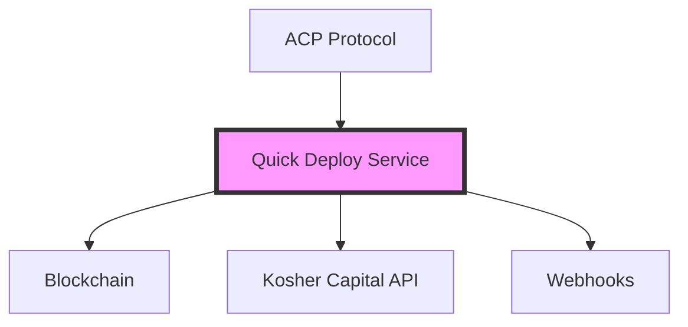

# Kosher Capital Integration Documentation Index

Welcome to the Kosher Capital ACP Integration documentation. This integration enables seamless deployment of AI trading agents through the Agent Communication Protocol (ACP).

## 📚 Documentation Structure

### Getting Started
- **[Quick Reference Guide](./kosher-capital-quick-reference.md)** - 5-minute setup and key commands
- **[Visual Flow Guide](./kosher-capital-visual-flow-guide.md)** - Diagrams and visual representations

### Comprehensive Guides
- **[Integration Documentation](./kosher-capital-integration.md)** - Complete integration overview
- **[Developer Guide](./kosher-capital-developer-guide.md)** - Architecture and extension guide
- **[Contract Reference](./kosher-capital-contract-reference.md)** - Contract addresses and gas costs

## 🎯 Quick Navigation

### For Different Roles

#### 👨‍💻 Developers
1. Start with the [Quick Reference](./kosher-capital-quick-reference.md)
2. Review the [Visual Flow Guide](./kosher-capital-visual-flow-guide.md) to understand the system
3. Deep dive into the [Developer Guide](./kosher-capital-developer-guide.md) for implementation details

#### 🏗️ System Architects
1. Review the [Integration Documentation](./kosher-capital-integration.md) for system overview
2. Study the architecture diagrams in the [Visual Flow Guide](./kosher-capital-visual-flow-guide.md)
3. Check the [Developer Guide](./kosher-capital-developer-guide.md) for extension patterns

#### 🧪 QA Engineers
1. See the Testing section in the [Integration Documentation](./kosher-capital-integration.md#testing)
2. Review test scripts in the [Quick Reference](./kosher-capital-quick-reference.md#-testing)
3. Understand error flows in the [Visual Flow Guide](./kosher-capital-visual-flow-guide.md#4-error-handling-flow)

## 🔑 Key Features

### Quick Deploy Service
- **Automated Deployment**: 3-transaction process for agent creation
- **Payment Processing**: 50 USDC payment verification
- **API Integration**: Seamless connection to Kosher Capital
- **Real-time Monitoring**: Status API and webhooks

### Technical Highlights
- **Modular Architecture**: Easy to extend and customize
- **Type-Safe**: Full TypeScript implementation
- **Well-Tested**: Comprehensive test suite
- **Production-Ready**: Error handling and retry logic

## 🚀 Quick Start

```bash
# 1. Clone and install
git clone <repo>
cd acp_integration
pnpm install

# 2. Configure
cp .env.quickdeploy.example .env
# Edit .env with your keys

# 3. Run
pnpm quickdeploy
```

## 📊 System Overview



## 🔗 Related Documentation

### ACP Documentation
- [ACP Overview](./ACP-OVERVIEW.md)
- [Getting Started with ACP](./getting-started.md)
- [Configuration Guide](./configuration.md)

### Other Integrations
- [Custom Logic Guide](./CUSTOM-LOGIC-GUIDE.md)
- [Business Use Cases](./BUSINESS-USE-CASES.md)

## 📝 Configuration Checklist

- [ ] Set `SHEKEL_API_KEY` from Kosher Capital
- [ ] Set `GAME_API_KEY` for GAME protocol
- [ ] Configure `WHITELISTED_WALLET_PRIVATE_KEY`
- [ ] Ensure wallet has 50+ USDC for deployments
- [ ] Configure callback URLs (optional)
- [ ] Set appropriate log levels

## 🛠️ Common Tasks

| Task | Command | Documentation |
|------|---------|---------------|
| Start service | `pnpm quickdeploy` | [Quick Reference](./kosher-capital-quick-reference.md) |
| Run tests | `pnpm test:quickdeploy` | [Testing Guide](./kosher-capital-integration.md#testing) |
| Check deployment | `curl localhost:3001/api/deployments/{id}` | [API Reference](./kosher-capital-integration.md#api-reference) |
| View logs | `LOG_LEVEL=debug pnpm quickdeploy` | [Troubleshooting](./kosher-capital-integration.md#troubleshooting) |

## 📞 Support

1. Check the [Troubleshooting Guide](./kosher-capital-integration.md#troubleshooting)
2. Review [Common Errors](./kosher-capital-quick-reference.md#-common-errors)
3. Enable debug logging for detailed information
4. Contact Kosher Capital support for API issues

## 🔄 Updates

This documentation is maintained alongside the codebase. For the latest updates:
- Check the git commit history
- Review recent pull requests
- Monitor the changelog

---

**Last Updated**: October 2025  
**Version**: 1.0.0  
**Maintainer**: Athena AI Team
