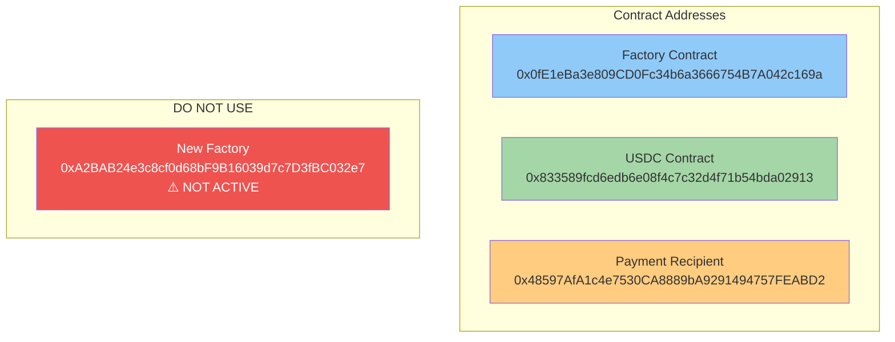

# Kosher Capital Contract Reference

## Base Mainnet Contracts



## Deployment Flow

```
1. Create Personal Fund
   Contract: 0x0fE1eBa3e809CD0Fc34b6a3666754B7A042c169a
   Method: createPersonalizedFunds(true, aiWallet, USDC_ADDRESS)
   
2. Payment Transfer (50 USDC)
   Contract: 0x833589fcd6edb6e08f4c7c32d4f71b54bda02913
   Method: transfer(PAYMENT_RECIPIENT, 50 * 10^6)
   To: 0x48597AfA1c4e7530CA8889bA9291494757FEABD2
   
3. Enable Trading
   Contract: [Created Personal Fund Address]
   Method: setTradingEnabled(true)
```

## API Configuration

```
Endpoint: https://parallax-analytics.onrender.com/api/v1/secure/fundDetails/quick-deploy
Method: POST
Header: x-api-key: [YOUR_SHEKEL_API_KEY]

Body:
{
  "agentName": "ACP-[timestamp]",
  "contractCreationTxnHash": "0x...",
  "creating_user_wallet_address": "0x...",
  "paymentTxnHash": "0x...",
  "deploySource": "ACP"
}
```

## Network Configuration

- **Network**: Base (Chain ID: 8453)
- **RPC URL**: https://base.llamarpc.com
- **Block Explorer**: https://basescan.org
- **USDC Decimals**: 6
- **Payment Amount**: 50 USDC (50000000 wei)

## Gas Requirements

Estimated gas costs for deployment:
1. Create Personal Fund: ~200,000 gas
2. USDC Transfer: ~65,000 gas
3. Enable Trading: ~50,000 gas

**Total**: ~315,000 gas units

At 0.1 gwei gas price: ~0.0000315 ETH
