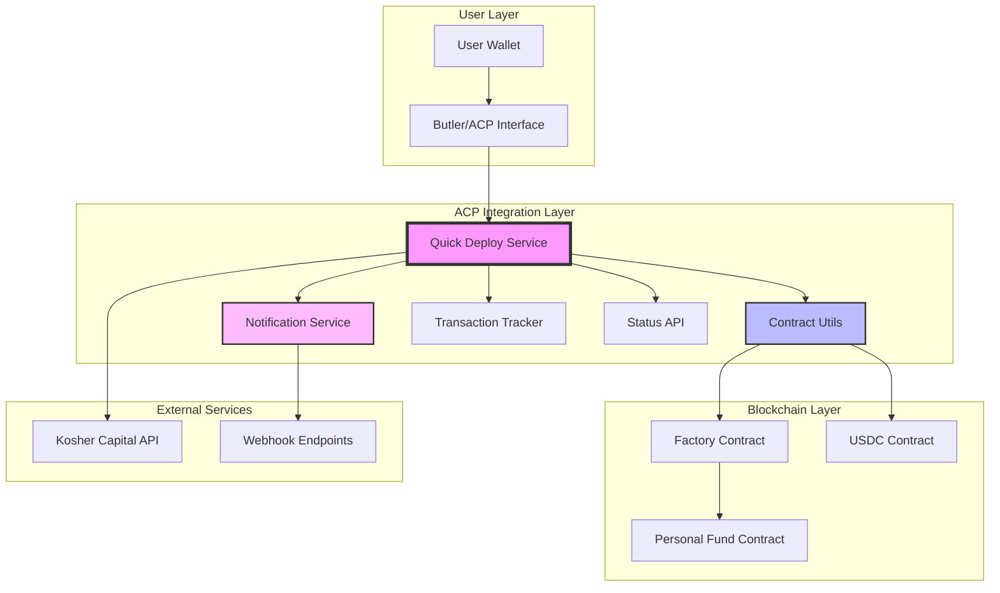
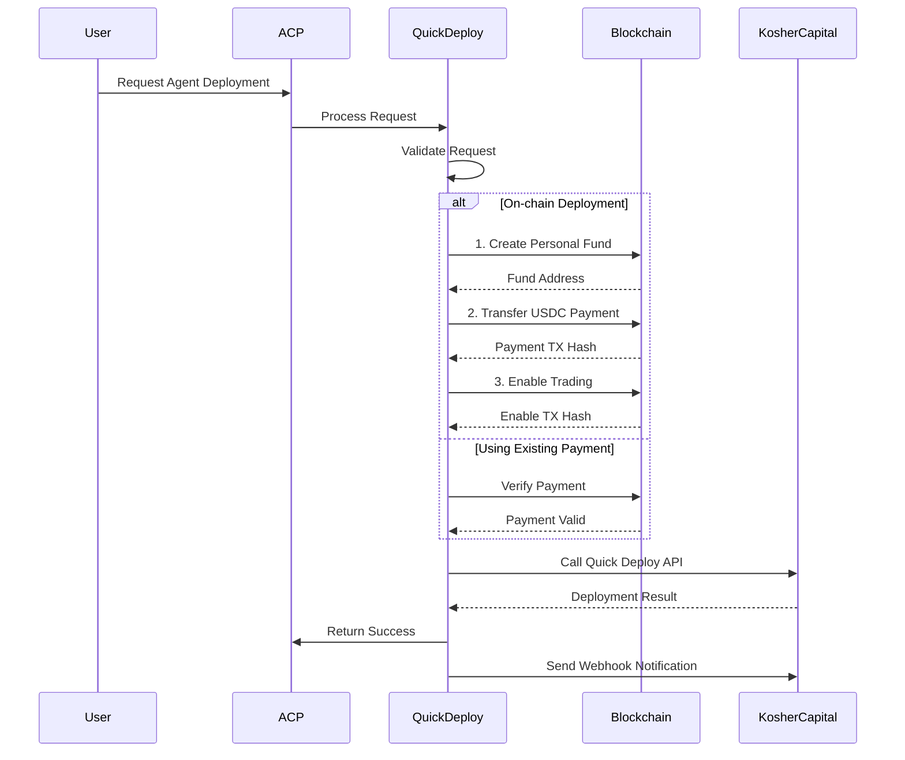

# Kosher Capital ACP Integration Documentation

## Table of Contents
1. [Overview](#overview)
2. [Architecture](#architecture)
3. [How It Works](#how-it-works)
4. [Quick Start Guide](#quick-start-guide)
5. [Configuration](#configuration)
6. [API Reference](#api-reference)
7. [Testing](#testing)
8. [Troubleshooting](#troubleshooting)

## Overview

The Kosher Capital ACP Integration enables AI trading agents to be deployed through the Agent Communication Protocol (ACP). This integration provides a seamless bridge between users wanting to deploy AI trading agents and Kosher Capital's infrastructure.

### Key Features
- **Quick Deploy Service**: Deploy AI trading agents with a single API call
- **On-chain Contract Deployment**: Automated 3-transaction deployment process
- **Payment Processing**: USDC payment verification and processing
- **Real-time Notifications**: Webhook notifications for deployment status
- **Transaction Tracking**: Complete audit trail of all deployments
- **Status API**: RESTful API for monitoring deployment status

## Architecture

### System Overview



### Component Interaction Flow



## How It Works

### 1. **Request Processing**

When a user initiates an agent deployment through ACP:

1. **Job Creation**: ACP creates a job with the deployment request
2. **Validation**: Quick Deploy service validates the request parameters
3. **Transaction Tracking**: A transaction record is created for audit trail

### 2. **On-Chain Deployment Process**

The deployment consists of three blockchain transactions:

```typescript
// Transaction 1: Create Personal Fund
const fundAddress = await factory.createPersonalizedFunds(
  true,              // isTokenFund
  aiWallet,          // AI wallet address
  USDC_ADDRESS       // Payment token address
);

// Transaction 2: USDC Payment (50 USDC)
await usdcContract.transfer(
  PAYMENT_RECIPIENT,
  parseUnits("50", 6)
);

// Transaction 3: Enable Trading
await fundContract.setTradingEnabled(true);
```

### 3. **API Integration**

After successful on-chain deployment, the service calls Kosher Capital's API:

```typescript
POST https://parallax-analytics.onrender.com/api/v1/secure/fundDetails/quick-deploy
Headers:
  - x-api-key: YOUR_API_KEY
  - Content-Type: application/json

Body:
{
  "agentName": "ACP-1234567890",
  "contractCreationTxnHash": "0x...",
  "creating_user_wallet_address": "0x...",
  "paymentTxnHash": "0x...",
  "deploySource": "ACP"
}
```

### 4. **Notification System**

The service sends notifications at key stages:
- Deployment success/failure callbacks
- Webhook events for tracking
- Transaction status updates

## Quick Start Guide

### Prerequisites

- Node.js 20 or higher
- pnpm package manager
- Access to Base network (RPC URL)
- Kosher Capital API key
- USDC tokens for deployment (50 USDC per agent)

### Installation

1. **Clone and Install**
```bash
# Clone the repository
git clone <repository-url>
cd acp_integration

# Install dependencies
pnpm install
```

2. **Configure Environment**
```bash
# Copy example configuration
cp .env.quickdeploy.example .env

# Edit .env with your values
```

3. **Key Configuration Values**
```env
# Required API Keys
SHEKEL_API_KEY=your-api-key-from-kosher-capital
GAME_API_KEY=your-game-api-key
WHITELISTED_WALLET_PRIVATE_KEY=your-deployment-wallet-key

# Network Configuration
ACP_RPC_URL=https://base.llamarpc.com
ACP_CHAIN_ID=8453

# Contract Addresses (Base Mainnet)
FACTORY_CONTRACT_ADDRESS=0x0fE1eBa3e809CD0Fc34b6a3666754B7A042c169a
PAYMENT_RECIPIENT_ADDRESS=0x48597AfA1c4e7530CA8889bA9291494757FEABD2
USDC_CONTRACT_ADDRESS=0x833589fcd6edb6e08f4c7c32d4f71b54bda02913

# Service Configuration
SERVICE_PRICE=50
```

### Running the Service

```bash
# Start Quick Deploy service
pnpm quickdeploy

# Or with debug logging
LOG_LEVEL=debug pnpm quickdeploy

# Run tests
pnpm test:quickdeploy
```

### Testing Deployment

```bash
# Run test deployment script
pnpm tsx test-utils/testQuickDeploy.ts

# Monitor deployment status
curl http://localhost:3001/api/deployments/{jobId}
```

## Configuration

### Environment Variables

| Variable | Description | Required | Default |
|----------|-------------|----------|---------|
| `SHEKEL_API_KEY` | Kosher Capital API key | Yes | - |
| `GAME_API_KEY` | GAME protocol API key | Yes | - |
| `WHITELISTED_WALLET_PRIVATE_KEY` | Deployment wallet private key | Yes | - |
| `ACP_RPC_URL` | Base network RPC URL | Yes | - |
| `FACTORY_CONTRACT_ADDRESS` | Factory contract address | No | 0x0fE1... |
| `SERVICE_PRICE` | USDC amount for deployment | No | 50 |
| `KOSHER_CAPITAL_CALLBACK_URL` | Webhook URL for notifications | No | - |
| `STATUS_API_PORT` | Port for status API | No | 3001 |

### Contract Addresses (Base Mainnet)

```typescript
// From constants.ts
export const CONTRACT_ADDRESSES = {
  FACTORY: '0x0fE1eBa3e809CD0Fc34b6a3666754B7A042c169a',
  FACTORY_NEW: '0xA2BAB24e3c8cf0d68bF9B16039d7c7D3fBC032e7', // DO NOT USE
  USDC: '0x833589fcd6edb6e08f4c7c32d4f71b54bda02913',
  PAYMENT_RECIPIENT: '0x48597AfA1c4e7530CA8889bA9291494757FEABD2',
} as const;
```

## API Reference

### Quick Deploy Service

#### Process Deployment Request

```typescript
interface QuickDeployParams {
  paymentTxHash?: string;      // Existing payment tx hash
  agentName?: string;          // Name for the agent
  userWallet: string;          // User's wallet address
  executeOnChain?: boolean;    // Execute deployment on-chain
  aiWallet?: string;           // AI wallet (defaults to userWallet)
}

// Response
interface AgentResponse {
  success: boolean;
  data?: {
    agentName: string;
    deploymentTxHash: string;
    contractAddress: string;
    apiResponse: any;
  };
  error?: string;
  errorType?: string;
  metadata?: object;
}
```

### Status API Endpoints

#### Health Check
```
GET /health
Response: { status: 'ok', timestamp: '...' }
```

#### Get Deployment Status
```
GET /api/deployments/:jobId
Response: {
  id: string;
  jobId: string;
  status: 'pending' | 'processing' | 'completed' | 'failed';
  agentName: string;
  createdAt: string;
  updatedAt: string;
  // ... additional fields
}
```

#### List All Deployments
```
GET /api/deployments?page=1&limit=10
Response: {
  data: TransactionRecord[];
  pagination: { page, limit, total, totalPages }
}
```

#### Get Statistics
```
GET /api/statistics
Response: {
  total: number;
  completed: number;
  failed: number;
  pending: number;
  avgProcessingTime: number;
}
```

### Webhook Events

The service sends webhook events for tracking:

```typescript
// Deployment Success
{
  event: 'agent.deployed',
  data: {
    jobId: string;
    agentName: string;
    contractAddress: string;
    txHash: string;
  },
  timestamp: string;
  source: 'ACP-QuickDeploy'
}

// Deployment Failed
{
  event: 'agent.deployment.failed',
  data: {
    jobId: string;
    error: string;
    errorType: string;
  },
  timestamp: string;
  source: 'ACP-QuickDeploy'
}
```

## Testing

### Unit Tests

```bash
# Run all tests
pnpm test

# Run Quick Deploy tests only
pnpm test quickDeploy

# Run with coverage
pnpm test:coverage
```

### Integration Testing

1. **Start Mock Services**
```bash
# Terminal 1: Start mock Kosher Capital server
pnpm tsx test-utils/mockKosherCapital.ts

# Terminal 2: Start Quick Deploy service
pnpm quickdeploy
```

2. **Run Test Deployment**
```bash
# Terminal 3: Execute test
pnpm tsx test-utils/testQuickDeploy.ts
```

### Manual Testing with ACP

1. Create a job through Butler/ACP interface
2. Monitor logs for processing
3. Check status API for results
4. Verify on blockchain explorer

## Troubleshooting

### Common Issues

#### 1. **API Key Not Configured**
```
Warning: SHEKEL_API_KEY environment variable not configured
```
**Solution**: Set `SHEKEL_API_KEY` in your `.env` file

#### 2. **Insufficient USDC Balance**
```
Error: Insufficient USDC balance: 10 USDC (need 50 USDC)
```
**Solution**: Ensure deployment wallet has at least 50 USDC

#### 3. **Contract Creation Failed**
```
Error: Fund creation transaction failed
```
**Solution**: 
- Check wallet has ETH for gas
- Verify factory contract address
- Ensure wallet is whitelisted

#### 4. **API Call Failed**
```
Error: Quick Deploy API call failed: 401
```
**Solution**: Verify API key is correct and active

### Debug Mode

Enable detailed logging:
```bash
LOG_LEVEL=debug LOG_API_OUTPUT=true pnpm quickdeploy
```

### Transaction Monitoring

View transaction logs:
```bash
# Check transaction logs
ls -la ./test-logs/

# View specific transaction
cat ./test-logs/tx-{jobId}.json
```

## Security Considerations

1. **Private Key Management**
   - Never commit private keys
   - Use environment variables
   - Consider using key management services

2. **API Key Security**
   - Rotate API keys regularly
   - Use different keys for different environments
   - Monitor API usage

3. **Contract Security**
   - Factory contract is audited
   - Verify contract addresses before deployment
   - Monitor for unusual activity

## Support

For issues or questions:
1. Check the troubleshooting guide
2. Review transaction logs
3. Contact Kosher Capital support
4. Submit issues to the repository

---

Last Updated: October 2025
