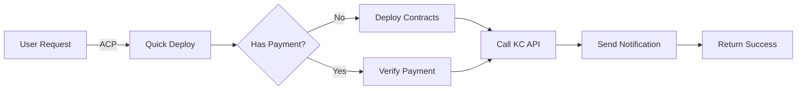

# Kosher Capital Quick Deploy - Quick Reference

## 🚀 5-Minute Setup

### 1. Install & Configure
```bash
# Clone and install
git clone <repo>
cd acp_integration
pnpm install

# Configure environment
cp .env.quickdeploy.example .env
# Edit .env with your API keys
```

### 2. Required Configuration
```env
# Minimum required in .env
SHEKEL_API_KEY=<from-kosher-capital>
GAME_API_KEY=<your-game-key>
WHITELISTED_WALLET_PRIVATE_KEY=<deployment-wallet>
```

### 3. Run Service
```bash
# Start Quick Deploy
pnpm quickdeploy

# Check status API
curl http://localhost:3001/health
```

## 📋 Quick Deploy Flow



## 🔧 Key Components

### Contract Addresses (Base Mainnet)
```typescript
FACTORY: 0x0fE1eBa3e809CD0Fc34b6a3666754B7A042c169a
USDC: 0x833589fcd6edb6e08f4c7c32d4f71b54bda02913
PAYMENT_TO: 0x48597AfA1c4e7530CA8889bA9291494757FEABD2
```

### API Endpoints
```
Quick Deploy API: POST https://parallax-analytics.onrender.com/api/v1/secure/fundDetails/quick-deploy
Status API: http://localhost:3001/api/deployments
```

## 💰 Deployment Cost
- **50 USDC** per agent deployment
- Additional gas fees for 3 transactions

## 📝 Request Format

```typescript
// ACP Request
{
  jobId: "acp-job-123",
  params: {
    userWallet: "0x...",        // Required
    agentName: "MyAgent",       // Optional
    executeOnChain: true,       // Default: true
    paymentTxHash: "0x..."      // If already paid
  }
}

// Response
{
  success: true,
  data: {
    agentName: "MyAgent",
    deploymentTxHash: "0x...",
    contractAddress: "0x...",
    apiResponse: { /* KC response */ }
  }
}
```

## 🧪 Testing

```bash
# Quick test
pnpm tsx test-utils/testQuickDeploy.ts

# With mock KC server
pnpm tsx test-utils/mockKosherCapital.ts # Terminal 1
pnpm quickdeploy                          # Terminal 2
pnpm tsx test-utils/testQuickDeploy.ts   # Terminal 3
```

## 📊 Monitor Deployments

```bash
# Check specific deployment
curl http://localhost:3001/api/deployments/{jobId}

# Get statistics
curl http://localhost:3001/api/statistics

# List all deployments
curl http://localhost:3001/api/deployments?page=1&limit=10
```

## 🚨 Common Errors

| Error | Solution |
|-------|----------|
| `SHEKEL_API_KEY not configured` | Set API key in .env |
| `Insufficient USDC balance` | Add 50+ USDC to wallet |
| `Fund creation failed` | Check gas & wallet whitelist |
| `API call failed: 401` | Verify API key is valid |

## 📞 Need Help?

1. Check logs: `LOG_LEVEL=debug pnpm quickdeploy`
2. View transaction logs: `ls ./test-logs/`
3. See full docs: [kosher-capital-integration.md](./kosher-capital-integration.md)
