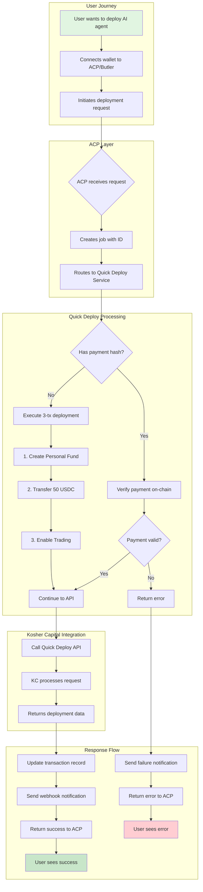
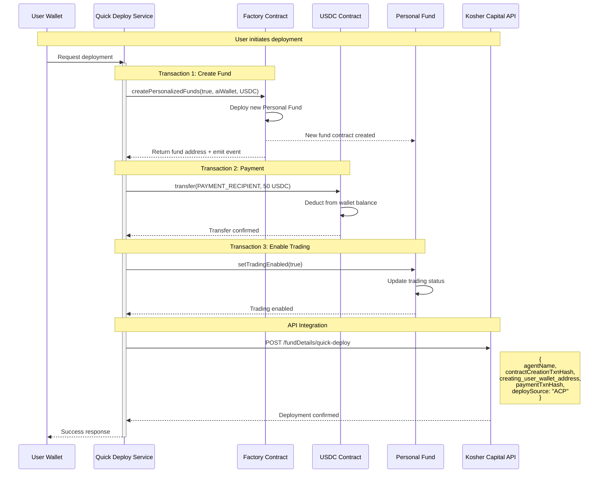
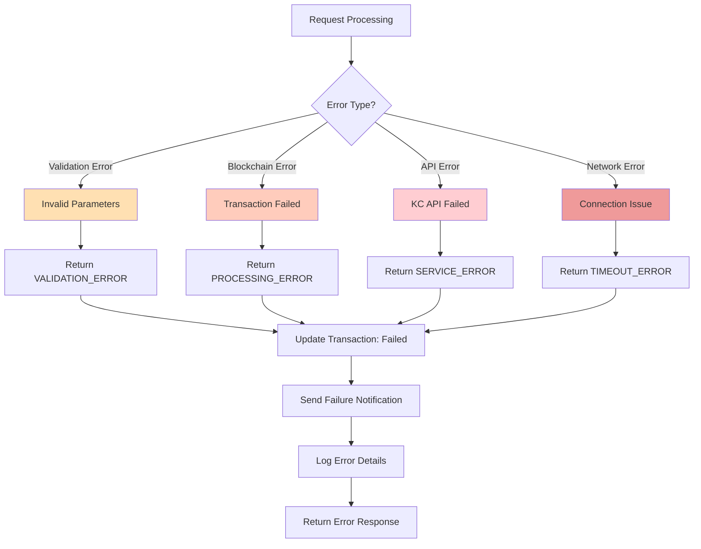
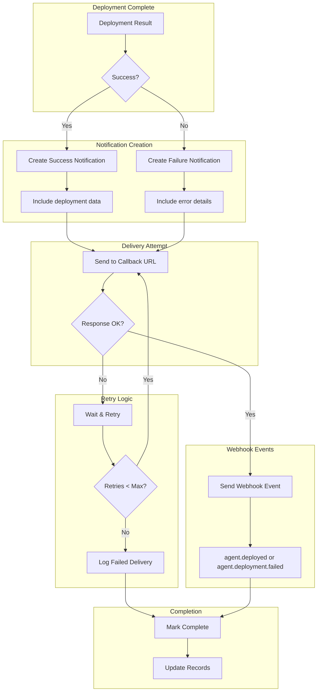
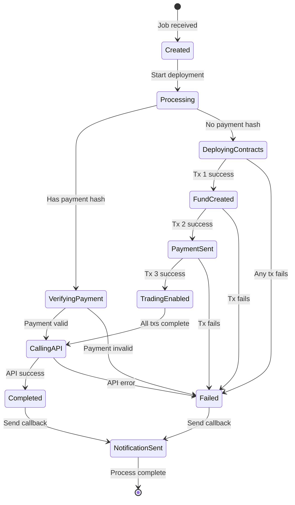
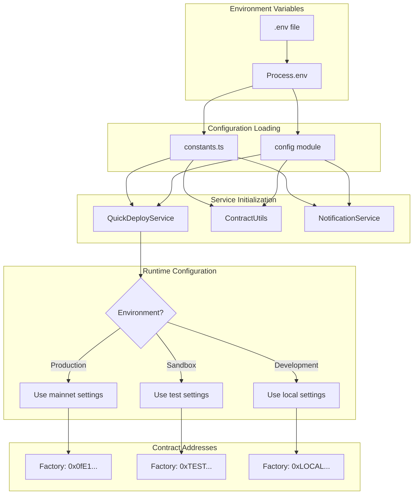
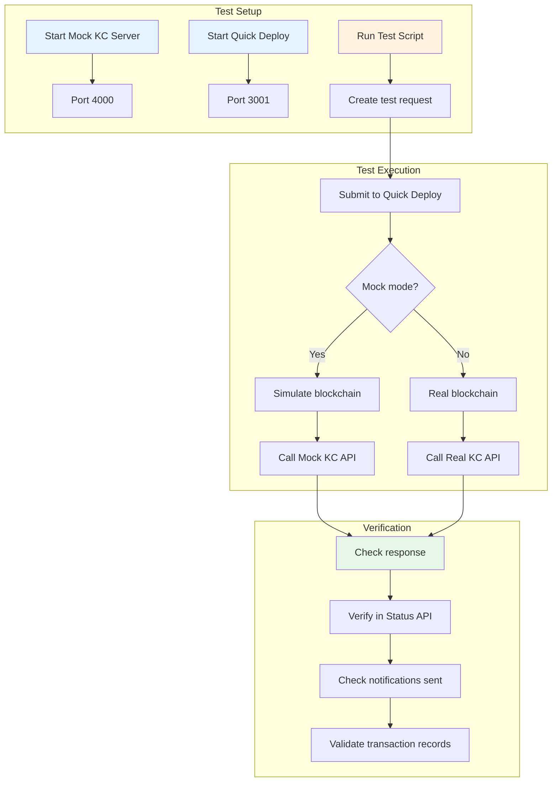

# Kosher Capital ACP Integration - Visual Flow Guide

## Overview Flow Diagram

This document provides visual representations of how the Kosher Capital integration works with ACP.

## 1. High-Level Integration Flow



## 2. Detailed Contract Deployment Flow



## 3. Status Monitoring Flow

```mermaid
graph LR
    subgraph "Client Monitoring"
        A[Status Check Request] --> B[Status API]
    end
    
    subgraph "Status API Endpoints"
        B --> C{Route}
        C -->|/health| D[Health Status]
        C -->|/api/deployments/:id| E[Single Deployment]
        C -->|/api/deployments| F[List Deployments]
        C -->|/api/statistics| G[Statistics]
    end
    
    subgraph "Data Source"
        E --> H[Transaction Tracker]
        F --> H
        G --> H
        H --> I[(In-Memory Store)]
    end
    
    subgraph "Response"
        D --> J[{status: ok}]
        E --> K[Deployment Details]
        F --> L[Paginated List]
        G --> M[Aggregate Stats]
    end
```

## 4. Error Handling Flow



## 5. Notification System Flow



## 6. Transaction State Lifecycle



## 7. Configuration and Environment Flow



## 8. Testing Flow



## Key Integration Points

### 1. **ACP Interface**
- Receives `AgentRequest` with job ID and parameters
- Returns `AgentResponse` with success/error status

### 2. **Blockchain Interaction**
- Factory Contract: Creates personal funds
- USDC Contract: Handles payments
- Personal Fund: Manages trading status

### 3. **Kosher Capital API**
- Endpoint: `/fundDetails/quick-deploy`
- Authentication: `x-api-key` header
- Payload: Agent and transaction details

### 4. **Notification System**
- Callback URL: Configurable endpoint
- Webhook Events: Real-time status updates
- Retry Logic: Ensures delivery

### 5. **Monitoring**
- Status API: REST endpoints
- Transaction Tracker: State management
- Logging: Comprehensive audit trail

## Quick Reference

### Contract Flow
```
1. createPersonalizedFunds() → Fund Address
2. transfer() → Payment Hash
3. setTradingEnabled() → Success
```

### API Flow
```
POST /quick-deploy
Headers: x-api-key
Body: { agentName, contractCreationTxnHash, ... }
```

### Status Check
```
GET /api/deployments/{jobId}
Response: { status, agentName, txHashes, ... }
```

---

For implementation details, see the [Developer Guide](./kosher-capital-developer-guide.md).
