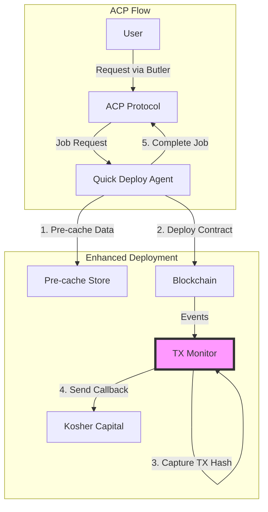

# Enhanced Quick Deploy ACP Service

## Overview

The Quick Deploy service is an ACP (Agent Commerce Protocol) seller agent that provides AI trading agent deployment services through the Virtuals Protocol ecosystem. This service has been enhanced with automatic transaction hash capture and callback functionality to optimize the deployment flow.

## Key Features

### 🚀 Automatic TX Hash Capture
- Monitors blockchain events in real-time
- Automatically captures transaction hashes as they're created
- No manual intervention required

### 📡 Webhook Callbacks
- Automatically sends TX hashes to Kosher Capital
- Configurable retry logic with exponential backoff
- Circuit breaker protection for resilience

### ⚡ Pre-caching & Optimization
- Pre-generates agent names with "ACP" prefix
- Caches deployment data during job acceptance
- Streamlines the deployment process

### 📊 Enhanced Status Feedback
- Real-time deployment status updates
- Comprehensive event tracking
- Detailed error reporting

## Architecture



## Configuration

### Environment Variables

```bash
# Required
SHEKEL_API_KEY=your-kosher-capital-api-key
WHITELISTED_WALLET_PRIVATE_KEY=your-private-key
WHITELISTED_WALLET_ENTITY_ID=your-entity-id
SELLER_AGENT_WALLET_ADDRESS=0x...

# Webhook Configuration (for automatic callbacks)
KOSHER_CAPITAL_WEBHOOK_URL=https://api.koshercapital.com/webhooks/deployment
WEBHOOK_SECRET=your-webhook-secret

# Optional
ACP_RPC_URL=custom-rpc-url
SERVICE_PRICE=50
STATUS_WEBHOOK_URL=https://api.koshercapital.com/webhooks/status
WEBHOOK_RETRY_ATTEMPTS=3
WEBHOOK_RETRY_DELAY_MS=1000
```

### Webhook Configuration

The service supports automatic webhook callbacks to send transaction hashes:

```typescript
// webhookConfig.ts
export const WEBHOOK_CONFIG = {
  url: process.env.KOSHER_CAPITAL_WEBHOOK_URL,
  headers: {
    'Content-Type': 'application/json',
    'x-api-key': process.env.SHEKEL_API_KEY,
    'x-webhook-secret': process.env.WEBHOOK_SECRET,
  },
  retryAttempts: 3,
  retryDelayMs: 1000,
};
```

## How It Works

### 1. Job Acceptance & Pre-caching
When a job is accepted, the service:
- Pre-generates an agent name with "ACP" prefix
- Caches deployment parameters
- Estimates gas requirements
- Gets current nonce for optimization

### 2. Automated Deployment
During deployment:
- Transaction monitor watches for blockchain events
- Captures transaction hashes as they occur
- No need to wait for manual TX hash input

### 3. Automatic Callbacks
After transactions are confirmed:
- TX hashes are automatically sent to Kosher Capital
- Retry logic ensures delivery
- Circuit breaker prevents cascade failures

### 4. Enhanced Status Updates
Throughout the process:
- Real-time status updates via webhooks
- Detailed event tracking
- Comprehensive error reporting

## Webhook Payload Examples

### Deployment Callback
```json
{
  "jobId": "job-123",
  "userWallet": "0x...",
  "fundAddress": "0x...",
  "creationTxHash": "0x...",
  "paymentTxHash": "0x...",
  "enableTradingTxHash": "0x...",
  "timestamp": "2025-10-01T12:00:00Z"
}
```

### Status Update
```json
{
  "jobId": "job-123",
  "status": "processing",
  "phase": "contract_deployment",
  "progress": 66,
  "message": "Contract deployed, processing payment...",
  "timestamp": "2025-10-01T12:00:00Z"
}
```

## Usage

### Basic Deployment (with automatic TX capture)

```typescript
const agent = new QuickDeployACPAgent();
await agent.initialize();

// Jobs are automatically enhanced with TX monitoring
// No additional configuration needed
```

### Custom Webhook Configuration

```typescript
import { getTransactionMonitor } from './quickDeploy';

const monitor = getTransactionMonitor(provider, {
  autoCapture: true,
  webhookUrl: 'https://your-webhook-url.com',
  callbackDelay: 3000, // 3 seconds
  maxRetries: 5,
});
```

### Disable Automatic Capture

If needed, automatic TX capture can be disabled per job:

```typescript
// In job metadata
{
  type: 'quick-deploy',
  metadata: {
    autoCaptureTxHash: false // Disable for this job
  }
}
```

## Benefits of Enhanced Flow

1. **No Manual Steps**: TX hashes are captured and sent automatically
2. **Faster Deployments**: Pre-caching reduces deployment time
3. **Better Reliability**: Retry logic and circuit breakers ensure resilience
4. **Real-time Updates**: Webhook callbacks provide instant status updates
5. **Simplified Integration**: No need to modify existing contract code

## Monitoring & Debugging

### Check Deployment Status
```bash
curl -X GET http://localhost:3001/api/deployments/{jobId}/status
```

### View Transaction Monitor Stats
```bash
curl -X GET http://localhost:3001/api/monitor/stats
```

### Enable Debug Logging
```bash
LOG_LEVEL=debug npm run quickdeploy
```

## Error Handling

The enhanced service includes:
- Automatic retry for failed webhooks
- Circuit breaker to prevent cascade failures
- Detailed error reporting
- Graceful fallback to standard deployment

## Testing

### Test Webhook Integration
```bash
# Set test webhook URL
export KOSHER_CAPITAL_WEBHOOK_URL=https://webhook.site/your-test-url

# Run in test mode
npm run quickdeploy:test
```

### Simulate Deployment
```bash
npm run test:deployment -- --jobId test-123
```

## Support

For issues with:
- **Webhook Configuration**: Check webhook URL and authentication
- **TX Hash Capture**: Verify blockchain events are being monitored
- **Pre-caching**: Ensure sufficient memory and valid parameters
- **Callbacks**: Check network connectivity and retry logs

---

**Version**: 2.0.0 (Enhanced with automatic TX capture)  
**Last Updated**: October 2025  
**Maintainer**: Athena AI Team
